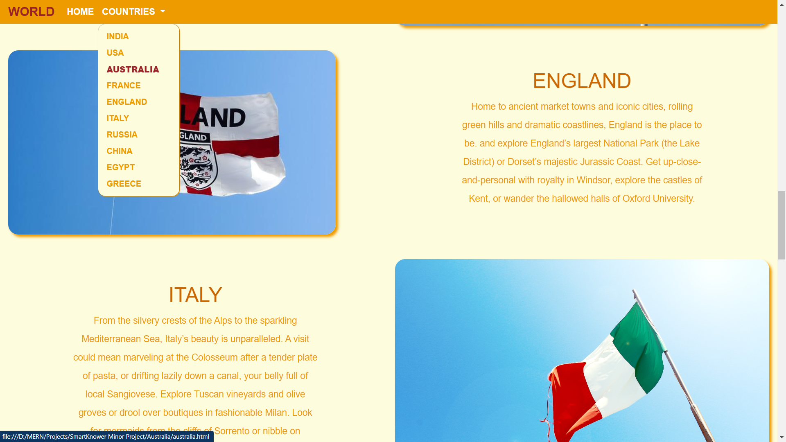

# Historical Places Website
A Responsive website made using HTML, CSS, BOOTSTRAP and a bit of JAVASCRIPT.  
<a href = "https://kanav-jain.github.io/HistoricalPlaces/">Link To The Website</a>
<h1><b>Features of the website</b></h1>
<ul>
<li>This website consists of 11 pages.</li>
<li>One of them is the homepage which contains link to all the other ten pages. we can access this link through three places - Dropdown, Picture of the Country and Name of the country.</li>
<li>Each child page represents a country through which we can access any other country(child page) and also the home page.</li>
<li>Site has a responsive navbar which collapses on shortening the screen</li>  
</ul>

<h2><b>Here is a snapshot of the Homepage.</b></h2>

