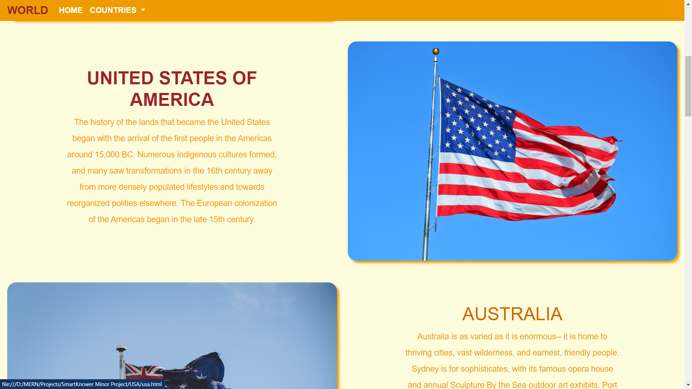

# Historical-Places-Website
A Responsive website made using HTML, CSS, BOOTSTRAP and a bit of JAVASCRIPT.

This website consists of 11 pages.
One of them is the homepage which contains link to all the other ten pages. we can access this link through three places - Dropdown, Picture of the Country and Name of the country.

Here is a snapshot of the Homepage.

